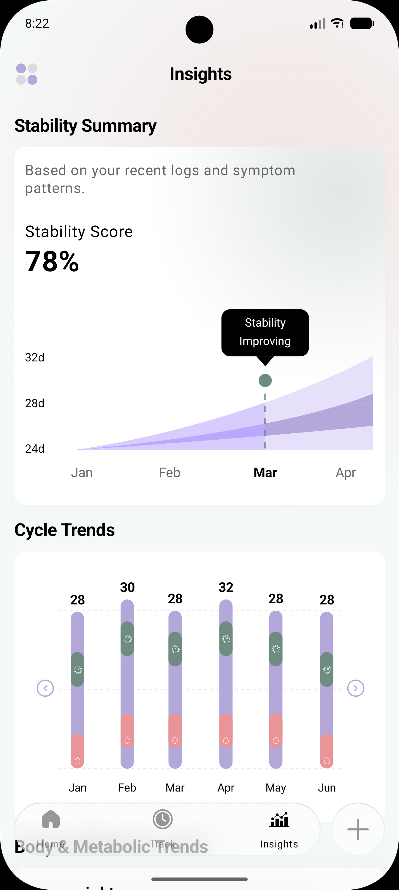
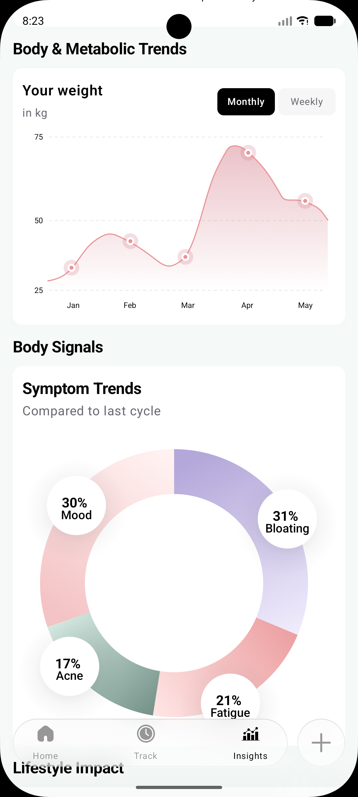
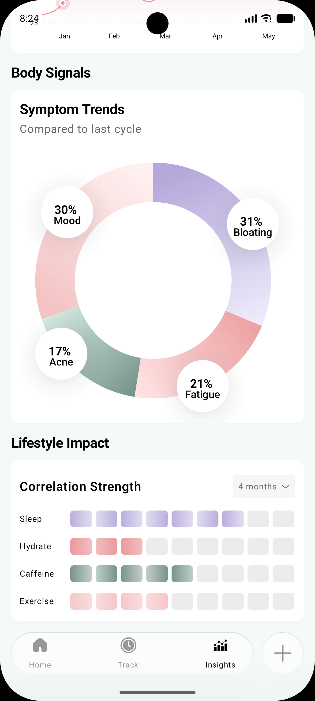

# Insights Dashboard — Android (Jetpack Compose)

A pixel-perfect Android implementation of a **health & wellness "Insights" dashboard**, built entirely with **Jetpack Compose** and **Canvas APIs**. The design was replicated from a high-fidelity Figma spec and features five rich data-visualization sections — all rendered declaratively without any third-party charting libraries.

---

## Table of Contents

- [Screenshots](#screenshots)
- [Demo Recording](#demo-recording)
- [Tech Stack](#tech-stack)
- [Architecture Overview](#architecture-overview)
- [Project Structure](#project-structure)
- [Design System](#design-system)
- [Feature-by-Feature Breakdown](#feature-by-feature-breakdown)
  - [1. Insights Screen (Orchestrator)](#1-insights-screen-orchestrator)
  - [2. Insights Header](#2-insights-header)
  - [3. Stability Summary Section](#3-stability-summary-section)
  - [4. Cycle Trends Section](#4-cycle-trends-section)
  - [5. Body & Metabolic Trends Section](#5-body--metabolic-trends-section)
  - [6. Body Signals Section (Donut Chart)](#6-body-signals-section-donut-chart)
  - [7. Lifestyle Impact Section (Heatmap)](#7-lifestyle-impact-section-heatmap)
  - [8. Bottom Navigation Bar (Liquid Glass)](#8-bottom-navigation-bar-liquid-glass)
- [Key Implementation Decisions](#key-implementation-decisions)
- [Dependencies](#dependencies)
- [Build & Run](#build--run)

---

## Screenshots

<p align="center">
  
  &nbsp;&nbsp;
  
  &nbsp;&nbsp;
  
</p>

| Screenshot | Sections Shown |
| ---------- | -------------- |
| **1.png** | Header, Stability Summary (score + dual-band chart) |
| **2.png** | Cycle Trends (stacked bars), Body & Metabolic Trends (weight line chart) |
| **3.png** | Body Signals (donut chart + bubbles), Lifestyle Impact (heatmap), Bottom Nav Bar |

---

## Demo Recording

▶️ **Full app walkthrough**: [`Recording/Assignment_recording.mp4`](Recording/Assignment_recording.mp4)

https://github.com/user-attachments/assets/Assignment_recording.mp4

> *If the video doesn't auto-play above, download it from the [`Recording/`](Recording/) folder.*

---

## Tech Stack

| Layer          | Technology                                                                 |
| -------------- | -------------------------------------------------------------------------- |
| Language       | **Kotlin**                                                                 |
| UI Framework   | **Jetpack Compose** (Material 3)                                           |
| Charts         | **Compose `Canvas` + `DrawScope`** — all charts hand-drawn, zero libraries |
| Typography     | **Google Fonts** (`DM Sans`) via `ui-text-google-fonts`                    |
| Glassmorphism  | **Haze** library (`dev.chrisbanes.haze`) v1.7.2                            |
| Min SDK        | 29 (Android 10)                                                            |
| Target / Compile SDK | 36                                                                   |
| Build System   | Gradle Kotlin DSL with Version Catalogs                                    |

---

## Architecture Overview

The project follows a **component-based unidirectional architecture**, influenced by MVVM principles:

```
┌──────────────┐
│ MainActivity │  ← Entry point; enables edge-to-edge, wraps in Theme
└──────┬───────┘
       │
┌──────▼───────────────┐
│   InsightsScreen      │  ← Orchestrator composable; scroll state, haze state
│   (ui/screens/)       │
└──────┬───────────────┘
       │ composes
       ├─► InsightsHeader
       ├─► StabilitySummarySection
       ├─► CycleTrendsSection
       ├─► BodyMetabolicTrendsSection
       ├─► BodySignalsSection
       ├─► LifestyleImpactSection
       └─► InsightsBottomBar
```

**Key decisions:**

- **No ViewModel** — The current scope is a single static dashboard with hardcoded data. A ViewModel was deemed overkill at this stage but the model layer is separated for easy future extension.
- **Model layer separated** — All data classes (`DonutSegment`, `HeatmapRow`, `BottomNavItem`, `BubbleSpec`, `HeatmapPalette`) live in `model/InsightsModels.kt`, cleanly decoupled from the UI.
- **Each section is a self-contained composable** — Every dashboard card is its own file with private helper composables, ensuring high cohesion and low coupling.

---

## Project Structure

```
app/src/main/java/com/example/insights_assignment/
│
├── MainActivity.kt                    # App entry point
│
├── model/
│   └── InsightsModels.kt              # Data classes for all chart models
│
└── ui/
    ├── components/
    │   ├── InsightsHeader.kt           # Top bar with menu icon + title
    │   ├── InsightsCard.kt             # Reusable card wrapper + SectionTitle
    │   ├── StabilitySummarySection.kt  # Stability score + dual-band area chart
    │   ├── CycleTrendsSection.kt       # Stacked bar chart with icon overlays
    │   ├── BodyMetabolicTrendsSection.kt  # SVG-aligned weight line chart
    │   ├── BodySignalsSection.kt       # Gradient donut chart + bubble overlays
    │   ├── LifestyleImpactSection.kt   # Correlation heatmap grid
    │   └── InsightsBottomBar.kt        # Floating glassmorphism nav bar
    │
    ├── screens/
    │   └── InsightsScreen.kt           # Main screen orchestrator
    │
    └── theme/
        ├── Color.kt                    # All color tokens (named semantically)
        ├── Theme.kt                    # Material3 theme with light/dark schemes
        └── Type.kt                     # DM Sans font family via Google Fonts
```

---

## Design System

### Typography

- **Font**: `DM Sans` loaded at runtime via **Google Fonts provider** (`androidx.compose.ui:ui-text-google-fonts`).
- **Weights used**: Normal (400), Medium (500), SemiBold (600), Bold (700).
- **Approach**: A single `FontFamily` object (`DMSansFontFamily`) with all four weights registered, referenced directly by composables. The provider authority is `com.google.android.gms.fonts` which loads the font from Google Play Services, avoiding bundling font files in the APK.

### Color Palette

Colors are defined as **semantic top-level vals** in `Color.kt` rather than inside a color scheme, because many colors (chart gradients, heatmap cells, donut segments) sit outside Material3's color role system. This gives fine-grained control for chart rendering:

| Token Group      | Examples                                             |
| ---------------- | ---------------------------------------------------- |
| Screen           | `ScreenBackground` (#F5FAF9)                         |
| Cycle Trends     | `CyclePurple`, `CycleGreen`, `CyclePink`             |
| Donut Chart      | `DonutBloating`, `DonutMood`, `DonutFatigue`, `DonutAcne` |
| Heatmap          | `HeatmapSleep`, `HeatmapHydrate`, `HeatmapCaffeine`  |
| Text             | `TextPrimary` (black), `TextSecondary` (#696770)     |
| Stability        | `StabilityGreen` (#6E8C82)                           |

### Card System

`InsightsCard` is a **reusable wrapper** providing:
- Consistent `RoundedCornerShape(12.dp)` corners
- A subtle ambient shadow (`Color(0x140D0A2C)`) applied via `Modifier.shadow()`
- White container with `0.dp` built-in elevation (shadow is manual, not Material)
- Internal padding of `12.dp` horizontal, `16.dp` vertical

Every section except `StabilitySummarySection` (which has its own glow-background card) uses `InsightsCard`.

---

## Feature-by-Feature Breakdown

### 1. Insights Screen (Orchestrator)

**File**: [`InsightsScreen.kt`](app/src/main/java/com/example/insights_assignment/ui/screens/InsightsScreen.kt)

**What it does**: Assembles all sections into a scrollable layout with a floating bottom bar.

**Implementation approach**:

| Feature | How it's implemented |
| ------- | -------------------- |
| **Edge-to-edge rendering** | `enableEdgeToEdge()` in `MainActivity` + `statusBarsPadding()` / `navigationBarsPadding()` modifiers |
| **Scroll state** | `rememberScrollState()` feeds a `verticalScroll()` modifier on the content `Box` |
| **Haze blur source** | The scrollable content `Box` is marked with `hazeSource(state = hazeState)` so the bottom bar can blur whatever is behind it |
| **Background glow** | `FigmaBackgroundGlow()` renders a `Canvas` with a `radialGradient` circle, using Figma-extracted coordinates. The gradient uses `CyclePink` with 5 alpha stops to simulate a soft ambient glow |
| **Bottom bar overlay** | `InsightsBottomBar` is placed with `Alignment.BottomCenter` and `zIndex(10f)` to float above content. Extra `Spacer(90.dp)` at the bottom ensures content isn't permanently obscured |

**Design rationale**: Using a `Box` with overlapping children (scroll content + bottom bar) instead of a `Scaffold` gives full control over the glassmorphism effect — the bar blurs content that scrolls behind it.

---

### 2. Insights Header

**File**: [`InsightsHeader.kt`](app/src/main/java/com/example/insights_assignment/ui/components/InsightsHeader.kt)

**What it does**: Displays the top row — a custom grid icon on the left and "Insights" title centered.

**Implementation approach**:

- **Centering trick**: The title is sandwiched between two `Spacer(weight(1f))` elements. A fixed `Spacer(width = 24.dp)` on the right balances out the 28 dp icon on the left, visually centering the title text.
- **Icon rendering**: Uses `painterResource` with `tint = Color.Unspecified` to render the vector drawable as-is (preserving multi-color SVG fills).
- **Typography**: Direct `fontSize`, `fontWeight`, `fontFamily` props instead of a Material3 text style, since the design uses non-standard size/weight combos.

---

### 3. Stability Summary Section

**File**: [`StabilitySummarySection.kt`](app/src/main/java/com/example/insights_assignment/ui/components/StabilitySummarySection.kt)

**What it does**: Shows a "78% Stability Score" card with a **dual-band area chart** indicating stability trends over Jan–Apr.

**Implementation approach**:

| Feature | Technique |
| ------- | --------- |
| **Card background glow** | A `Canvas` is placed behind the card content inside a `Box` + `clip(cardShape)`. It draws a `radialGradient` circle in `StabilityGreen` positioned at the top-right corner, giving the card a subtle green ambient glow |
| **Dual-band area chart** | Two `Path` objects (`outerBandPath`, `innerBandPath`) are drawn using **Bézier cubic curves** extracted directly from the Figma SVG data. The paths represent confidence bands that fan out over time |
| **Pre/post region coloring** | `clipRect()` is used to mask the left portion of the chart and paint it with a **darker purple** (`outerPreColor`, `innerPreColor`), while the unclipped region uses a lighter shade. This creates the visual distinction before/after the "Stability Improving" marker |
| **Coordinate mapping** | Helper functions `svgX()` / `svgY()` translate raw SVG path coordinates into Canvas-local coordinates, scaling proportionally based on the component's actual rendered size vs. the 319×190 dp design frame |
| **Tooltip** | A black rounded rectangle + triangular pointer drawn via `drawRoundRect` and a `Path`. Text ("Stability / Improving") is rendered with `drawText()` and centered via `TextMeasurer` |
| **Current marker** | A `StabilityGreen` filled circle + dashed vertical line using `PathEffect.dashPathEffect()` |
| **Responsive scaling** | `BoxWithConstraints` + `aspectRatio()` ensures the chart scales proportionally on any screen width |

**Why Canvas instead of a library?** The dual-band area chart with clipped region coloring and custom SVG-path curves is too specialized for generic charting libraries. Drawing directly on Canvas gives pixel-level control.

---

### 4. Cycle Trends Section

**File**: [`CycleTrendsSection.kt`](app/src/main/java/com/example/insights_assignment/ui/components/CycleTrendsSection.kt)

**What it does**: Displays a **stacked/segmented bar chart** showing 6 months of cycle data (Jan–Jun) with three color bands per bar (purple, green, pink).

**Implementation approach**:

| Feature | Technique |
| ------- | --------- |
| **Bar rendering** | Each bar is a stack of three `drawRoundRect()` calls with the same x-position but different y/height values. Purple is the full-height background bar, green and pink segments overlay at specific positions |
| **Per-bar specs** | A `BarSpec` data class captures exact Figma coordinates (`x`, `top`, `totalH`, `greenY`, `greenH`, `pinkY`, `pinkH`) for each bar. This avoids algorithmic layout and guarantees Figma-exact positioning |
| **Value labels** | Cycle day counts (28, 30, 28, 32, …) are drawn above each bar using `drawText()` with `TextMeasurer`, center-aligned by measuring text width |
| **Month labels** | Positioned at `y(211dp)` below the bars |
| **Dashed grid lines** | Three horizontal dashed lines drawn with `PathEffect.dashPathEffect()` at exact Figma Y positions |
| **Icon overlays** | Sun (☀) and droplet (💧) icons are **Compose `Icon` composables** positioned with `absoluteOffset()` inside the `BoxWithConstraints`. This was necessary because `Canvas.drawImage()` would require converting vector drawables to `ImageBitmap`, which adds complexity. Using Compose icons overlaid on the Canvas was simpler and more maintainable |
| **Navigation arrows** | Left/right arrow icons also positioned via `absoluteOffset()` at Figma-matching coordinates |
| **Scale-aware sizing** | `layoutScale = maxWidth.value / designWidth.value` scales all icon sizes and offsets proportionally |

---

### 5. Body & Metabolic Trends Section

**File**: [`BodyMetabolicTrendsSection.kt`](app/src/main/java/com/example/insights_assignment/ui/components/BodyMetabolicTrendsSection.kt)

**What it does**: Displays a **weight line chart** with an area gradient fill, ring markers, and Monthly/Weekly tab toggle.

**Implementation approach**:

| Feature | Technique |
| ------- | --------- |
| **Tab toggle** | A `Row` of two `Box` composables styled as pill buttons. `mutableStateOf("Monthly")` tracks selection. Selected tab gets a black background with white text; inactive gets `InactiveBg` gray |
| **SVG-aligned line path** | The weight curve is a single `Path` built from **10 consecutive cubic Bézier segments** whose control points were extracted from the Figma SVG `<path>` element. A custom `Path.cubicTo(Offset, Offset, Offset)` extension simplifies the call syntax |
| **Coordinate system** | A `cardToCanvas(cx, cy)` function translates from Figma "card-local" coordinates (where the card content starts at `x=12, y=67`) into Canvas-local pixel coordinates. This avoids manual offset math for every point |
| **Area fill** | The `linePath` is duplicated into an `areaPath` that extends down to the baseline (`y=228.455`) and closes. This closed path is filled with a `Brush.verticalGradient` from `Color(0xFFD27A88)` at 46% alpha fading to fully transparent |
| **Line stroke** | `drawPath(linePath, CyclePink, Stroke(width, cap = StrokeCap.Round))` renders a smooth, rounded line on top of the fill |
| **Ring markers** | At 5 data points, three concentric circles are drawn: (1) a large transparent pink shadow ring, (2) a white fill circle, (3) a small pink center dot. This creates the "drop shadow ring" effect from the Figma design |
| **Dashed grid + Y-axis labels** | Three horizontal dashed lines at y-values 72, 157, 228 (Figma coords) with "75", "50", "25" labels right-aligned before the grid start |

---

### 6. Body Signals Section (Donut Chart)

**File**: [`BodySignalsSection.kt`](app/src/main/java/com/example/insights_assignment/ui/components/BodySignalsSection.kt)

**What it does**: Renders a **gradient donut ring chart** with four symptom segments (Bloating 31%, Mood 30%, Fatigue 21%, Acne 17%) and floating **bubble overlays** showing percentages.

**Implementation approach**:

| Feature | Technique |
| ------- | --------- |
| **Donut ring** | `drawArc()` with `Stroke(width, cap = StrokeCap.Butt)` for each segment. The stroke width is 33.5% of the ring radius, creating a thick donut without a fill center |
| **Segment gradients** | Each segment gets a unique `Brush.linearGradient()` whose start/end points are computed relative to the ring center and radius. This creates the per-segment color shift visible in the Figma design (e.g., Bloating transitions from purple to light lavender) |
| **Sweep calculation** | `(segment.percentage / total) * 360f` starting from `-90f` (12 o'clock position) |
| **Bubble overlays** | Four `BubbleSpec` objects define exact Figma X/Y positions for white circles overlaid on the donut. Each bubble has: (1) a `radialGradient` soft shadow behind it, (2) a white filled circle, (3) bold percentage text, (4) medium-weight label text — all drawn with `drawText()` |
| **Coordinate system** | `figmaToCanvas(fgX, fgY)` translates from the Figma "group origin" coordinate space to Canvas pixels. The group has an 18px offset from the card content area |
| **Data model** | `DonutSegment` holds label/percentage/color. `BubbleSpec` wraps a segment with X/Y positions. Both are defined in `model/InsightsModels.kt` |

---

### 7. Lifestyle Impact Section (Heatmap)

**File**: [`LifestyleImpactSection.kt`](app/src/main/java/com/example/insights_assignment/ui/components/LifestyleImpactSection.kt)

**What it does**: A **9-column correlation heatmap** grid for Sleep, Hydrate, Caffeine, and Exercise — each row colored according to its theme.

**Implementation approach**:

| Feature | Technique |
| ------- | --------- |
| **Heatmap grid** | 4 rows × 9 cells. Each cell is a `Box` with `clip(RoundedCornerShape)` and a `background(Brush)`. Filled cells use the row's gradient brush; unfilled cells use `emptyBrush` (a flat gray gradient) |
| **Per-cell gradients** | Each filled cell has its **own unique** `Brush.horizontalGradient` stored in `rowPalettes` (a `Map<String, List<Brush>>`). This was extracted from the Figma design where each cell has a slightly different gradient direction to create a subtle shimmer effect |
| **Responsive layout** | `BoxWithConstraints` calculates `labelWidth`, `cellWidth`, `cellHeight`, `cellGap`, `rowGap`, and `cellRadius` as **proportional percentages** of the available width, clamped to min/max bounds. This ensures the heatmap looks correct from narrow phones to tablets |
| **Dropdown menu** | A Material3 `DropdownMenu` anchored to a clickable chip showing "4 months". Four options available (1, 3, 4, 6 months). State managed with `mutableStateOf` |
| **Data model** | `HeatmapRow(label, color, filledCount)` defines the row config. The `filledCount` value determines how many of the 9 cells are colored |

---

### 8. Bottom Navigation Bar (Liquid Glass)

**File**: [`InsightsBottomBar.kt`](app/src/main/java/com/example/insights_assignment/ui/components/InsightsBottomBar.kt)

**What it does**: A floating, **frosted-glass** bottom navigation bar with a pill shape + circular add button, replicating the iOS-style "liquid glass" aesthetic.

**Implementation approach**:

| Feature | Technique |
| ------- | --------- |
| **Glassmorphism blur** | The **Haze** library (`dev.chrisbanes.haze`) provides real-time background blur. The main content is marked as `hazeSource()`, and the bottom bar uses `hazeEffect()` with a custom `HazeStyle` (25dp blur radius, white tint at 55% alpha) |
| **Pill shape** | `RoundedCornerShape(100)` creates a fully rounded pill. Applied to both `clip()` and `shadow()` |
| **Glass border** | A `Brush.verticalGradient` from semi-transparent grays creates the subtle edge border typical of glass UI. Applied with `Modifier.border(width = 0.75.dp, brush)` |
| **Shadow** | `Modifier.shadow(32.dp, shape, ambientColor, spotColor)` with `clip = false` renders the shadow outside the clip bounds, creating a realistic floating effect |
| **Layered background** | After blur, a `Color.White.copy(alpha = 0.20f)` background adds the frosted white overlay |
| **Circle button** | Identical technique as the pill but with `CircleShape`. Houses a "+" add icon |
| **Navigation items** | Defined in a `List<BottomNavItem>` (data class from models). Active items get `Color.Black`; inactive items get `Color.Black.copy(alpha = 0.4f)` |
| **Edge-to-edge safe** | `navigationBarsPadding()` ensures the bar doesn't overlap the system navigation area |

---

## Key Implementation Decisions

### 1. All Charts Drawn with Compose Canvas — No Charting Library

**Why**: Every chart in this design has unique styling requirements (dual-band areas with region clipping, SVG-path-aligned curves, gradient donut arcs, per-cell gradient heatmaps) that would require heavy customization of any third-party library. Drawing on Canvas provides:
- Pixel-perfect alignment with the Figma spec
- Zero dependency overhead for charts
- Full control over gradients, paths, and text placement

### 2. Figma SVG Coordinates Used Directly

**Why**: Rather than "approximating" chart curves mathematically, the **exact control points from Figma's exported SVG `<path>` elements** are used. Functions like `svgX()`, `svgY()`, `cardToCanvas()` translate these coordinates proportionally to the rendered canvas size. This guarantees visual fidelity.

### 3. Haze for Glassmorphism Over Custom RenderEffect

**Why**: Android's `RenderEffect.createBlurEffect()` requires API 31+. The Haze library back-ports background blur to API 29+ and integrates natively with Compose modifiers. It also provides material-style tints out of the box.

### 4. Google Fonts Provider Over Bundled Font Files

**Why**: Using `com.google.android.gms.fonts` as the provider loads DM Sans from Google Play Services at runtime. This:
- Reduces APK size (no .ttf files bundled)
- Guarantees the latest font version
- Works on all devices with Google Play Services

### 5. Semantic Color Tokens Over Material3 Color Roles

**Why**: Material3's `ColorScheme` has fixed roles (primary, secondary, etc.) designed for standard UI components. Chart colors (donut segments, heatmap cells, gradient stops) don't map to these roles. Defining them as top-level `val` constants in `Color.kt` keeps them easily discoverable while remaining fully type-safe.

### 6. Edge-to-Edge with Manual Insets

**Why**: `enableEdgeToEdge()` draws behind system bars for a full-bleed design. `statusBarsPadding()` on the scroll container and `navigationBarsPadding()` on the bottom bar handle insets manually, giving more layout control than `Scaffold` would provide.

---

## Dependencies

| Dependency | Purpose | Version |
| ---------- | ------- | ------- |
| `androidx.compose.material3` | Material3 component library | BOM-managed |
| `androidx.compose.material:material-icons-extended` | Extended icon set | BOM-managed |
| `androidx.compose.ui:ui-text-google-fonts` | Runtime Google Fonts loading | BOM-managed |
| `dev.chrisbanes.haze:haze` | Background blur (glassmorphism) | 1.7.2 |
| `dev.chrisbanes.haze:haze-materials` | Material-style haze presets | 1.7.2 |
| `androidx.activity:activity-compose` | Compose Activity integration | BOM-managed |
| `androidx.lifecycle:lifecycle-runtime-ktx` | Lifecycle-aware coroutines | BOM-managed |

---

## Build & Run

### Prerequisites

- **Android Studio** Ladybug or later (with Compose support)
- **JDK 11+**
- **Android SDK** with API 36 installed
- A device / emulator running **Android 10 (API 29)** or higher

### Steps

```bash
# Clone the repository
git clone <repo-url>
cd InsightsAssignment

# Open in Android Studio and let Gradle sync

# Run on connected device / emulator
./gradlew installDebug
```

Or simply press **▶ Run** in Android Studio with the `app` configuration selected.

---

## Drawable Resources

All icons are **vector drawables** (XML) located in `res/drawable/`:

| File | Usage |
| ---- | ----- |
| `ic_header_grid.xml` | Menu icon in the header row |
| `ic_sun.xml` | Sun icons on Cycle Trends chart bars |
| `ic_droplet.xml` | Droplet icons on Cycle Trends chart bars |
| `ic_arrow_left.xml` | Left navigation arrow in Cycle Trends |
| `ic_arrow_right.xml` | Right navigation arrow in Cycle Trends |
| `ic_arrow_down.xml` | Dropdown chevron in Lifestyle Impact |
| `ic_nav_home.xml` | "Home" icon in bottom bar |
| `ic_nav_track.xml` | "Track" icon in bottom bar |
| `ic_nav_insights.xml` | "Insights" icon in bottom bar (active) |
| `ic_nav_add.xml` | "+" icon in the circular add button |

---

## License

This project was created as an assignment submission. All rights reserved.
